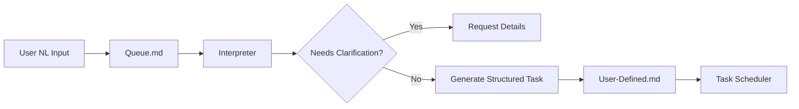

Excellent question! You're essentially designing a task scheduling and behavior system for agents that needs to be both human-readable and machine-parseable. Here's a structured approach that leverages markdown while maintaining the flexibility for natural language input:

## Proposed Structure: Agent Behavior as Markdown

### 1. **Agent Manifest File** (`agent/manifest.md`)
```markdown
---
agent_id: "repo-md-assistant"
version: "1.0.0"
created: "2024-12-20"
capabilities: ["content-management", "analytics", "planning"]
---

# Agent Behavior Manifest

## Core Behaviors
- [[./behaviors/daily.md|Daily Tasks]]
- [[./behaviors/weekly.md|Weekly Tasks]]
- [[./behaviors/monthly.md|Monthly Tasks]]
- [[./behaviors/triggered.md|Event-Triggered Tasks]]
- [[./behaviors/user-defined.md|User-Defined Tasks]]
```

### 2. **Structured Behavior Files** (`agent/behaviors/daily.md`)
```markdown
---
type: "recurring"
frequency: "daily"
---

# Daily Tasks

## content-health-check
- time: "09:00"
- duration: "15m"
- priority: "high"
- description: "Scan all content for broken links and outdated references"
- actions:
  - Check all markdown files for dead links
  - Verify image references exist
  - Flag content older than 6 months for review

## analytics-summary
- time: "17:00"
- duration: "30m"
- priority: "medium"
- description: "Compile daily analytics and insights"
- output: "/reports/daily/{{date}}.md"
```

### 3. **Natural Language Task Queue** (`agent/tasks/queue.md`)
```markdown
# Task Queue
<!-- User inputs stored here, awaiting interpretation -->

## Pending Interpretation

### 2024-12-20T14:32:00Z
user: "Check SEO scores every week and suggest improvements"
status: pending
interpreted: null

### 2024-12-20T15:45:00Z
user: "remind me to update the API docs before each release"
status: pending
interpreted: null

## Interpreted Tasks

### 2024-12-20T13:00:00Z
user: "analyze competitor blogs monthly"
status: interpreted
interpreted:
  type: recurring
  frequency: monthly
  day: 1  # First day of month
  time: "10:00"
  task:
    id: "competitor-analysis"
    description: "Analyze competitor blog posts and content strategy"
    actions:
      - Scan top 5 competitor sites
      - Compare posting frequency
      - Identify trending topics
    output: "/reports/competitive/{{year}}-{{month}}.md"
```

## Task Interpreter Pattern

### Interpreter Module (`agent/interpreter/task-parser.js`)
```javascript
// This would be part of your agent's runtime
class TaskInterpreter {
  async interpret(naturalLanguageTask) {
    // Parse the NL input
    const parsed = await this.parseNaturalLanguage(naturalLanguageTask);
    
    // Determine timing if not explicit
    const timing = this.inferTiming(parsed);
    
    // Create structured task
    return {
      id: generateId(parsed.action),
      type: parsed.isRecurring ? 'recurring' : 'once',
      frequency: timing.frequency,
      time: timing.time || this.suggestOptimalTime(parsed),
      priority: this.inferPriority(parsed),
      description: parsed.description,
      actions: this.extractActions(parsed),
      output: this.determineOutput(parsed)
    };
  }

  suggestOptimalTime(parsed) {
    // Smart scheduling based on task type
    const taskPatterns = {
      'analysis': '10:00',     // Morning for analytical work
      'report': '16:00',       // Afternoon for summaries
      'check': '09:00',        // Start of day for checks
      'backup': '02:00',       // Night for maintenance
      'review': '14:00'        // Post-lunch for reviews
    };
    
    // Find matching pattern or default
    const taskType = this.identifyTaskType(parsed);
    return taskPatterns[taskType] || '12:00';
  }
}
```

### 4. **Interpreted Task Storage** (`agent/behaviors/user-defined.md`)
```markdown
---
type: "user-defined"
last_updated: "2024-12-20T16:00:00Z"
---

# User-Defined Tasks

## weekly-seo-check
- source: "Check SEO scores every week and suggest improvements"
- interpreted_at: "2024-12-20T14:35:00Z"
- frequency: "weekly"
- day: "monday"
- time: "11:00"
- duration: "45m"
- priority: "medium"
- actions:
  - Run SEO analysis on all pages
  - Generate improvement suggestions
  - Create PR with meta tag updates
- output: "/reports/seo/week-{{week}}.md"

## pre-release-docs
- source: "remind me to update the API docs before each release"
- interpreted_at: "2024-12-20T15:50:00Z"
- frequency: "triggered"
- trigger: "release:preparing"
- priority: "high"
- actions:
  - Scan for API changes since last release
  - Update endpoint documentation
  - Generate changelog entries
- output: "/docs/api/changelog-{{version}}.md"
```

## Implementation Strategy

### 1. **Markdown as Source of Truth**
```
agent/
├── manifest.md              # Agent configuration
├── behaviors/              
│   ├── daily.md            # Fixed daily routines
│   ├── weekly.md           # Weekly tasks
│   ├── monthly.md          # Monthly planning
│   ├── triggered.md        # Event-based tasks
│   └── user-defined.md     # Interpreted user tasks
├── tasks/
│   ├── queue.md            # Pending NL tasks
│   └── history/            # Completed tasks by date
├── interpreter/
│   ├── rules.md            # Interpretation rules
│   └── patterns.md         # Learned patterns
└── logs/
    └── 2024-12-20.md       # Execution logs
```

### 2. **Interpreter Workflow**


### 3. **Task Execution Format**
```markdown
# Task Execution Log - 2024-12-20

## 09:00 - content-health-check
- status: completed
- duration: 12m
- findings:
  - 3 broken links found
  - 5 images need optimization
  - 2 posts flagged for staleness
- actions_taken:
  - Created issues for broken links
  - Queued image optimization
  - Notified authors about stale content

## 11:00 - weekly-seo-check
- status: completed
- duration: 38m
- report: [[/reports/seo/week-51.md]]
- improvements_suggested: 7
- auto_fixed: 3
```

## Key Benefits of This Approach

1. **Human Readable**: Everything is in markdown, easy to review and modify
2. **Git Trackable**: All changes to agent behavior are versioned
3. **Agent Parseable**: Structured enough for machines to execute
4. **Flexible**: Natural language can be gradually interpreted into structure
5. **Auditable**: Clear history of what was requested vs. what was interpreted

## Smart Interpretation Features

The interpreter should handle:
- **Temporal inference**: "every morning" → "daily at 09:00"
- **Context awareness**: "before release" → trigger-based task
- **Priority inference**: "urgent" / "when you have time" → priority levels
- **Dependency detection**: "after the backup completes" → task chaining
- **Ambiguity resolution**: Store multiple interpretations for user confirmation

This system gives you the best of both worlds: the flexibility of natural language input with the reliability of structured task execution, all stored in your Git-native markdown format.