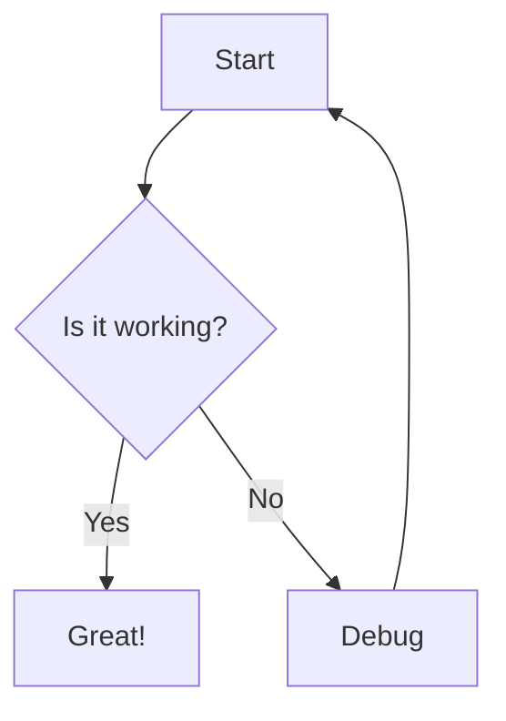
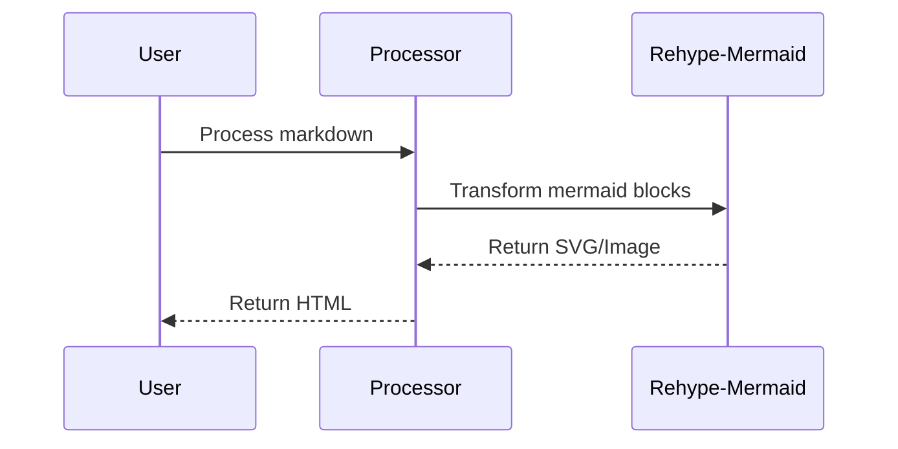
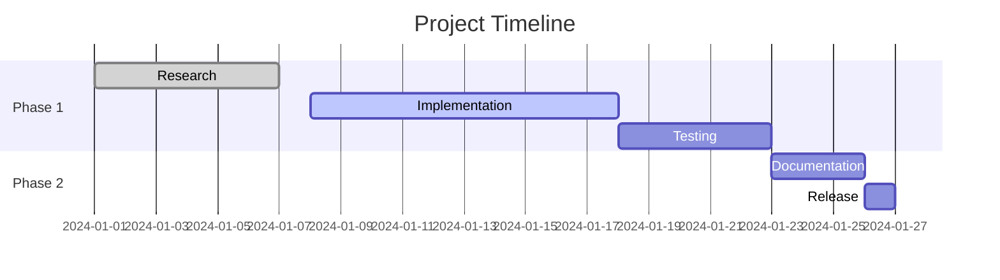
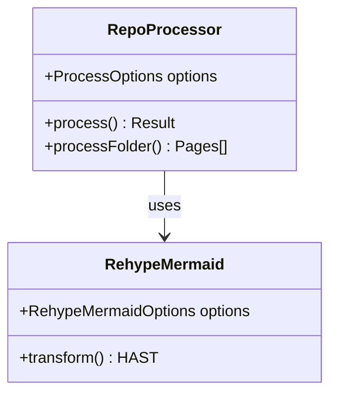
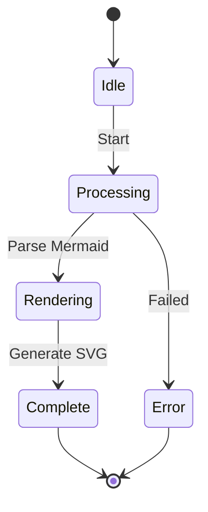
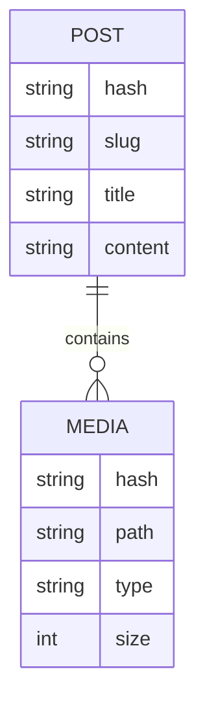

# Mermaid Diagram Examples

This page demonstrates various Mermaid diagram types rendered using rehype-mermaid.

## Flowchart

## Sequence Diagram

## Gantt Chart

## Class Diagram

## State Diagram

## Entity Relationship Diagram

