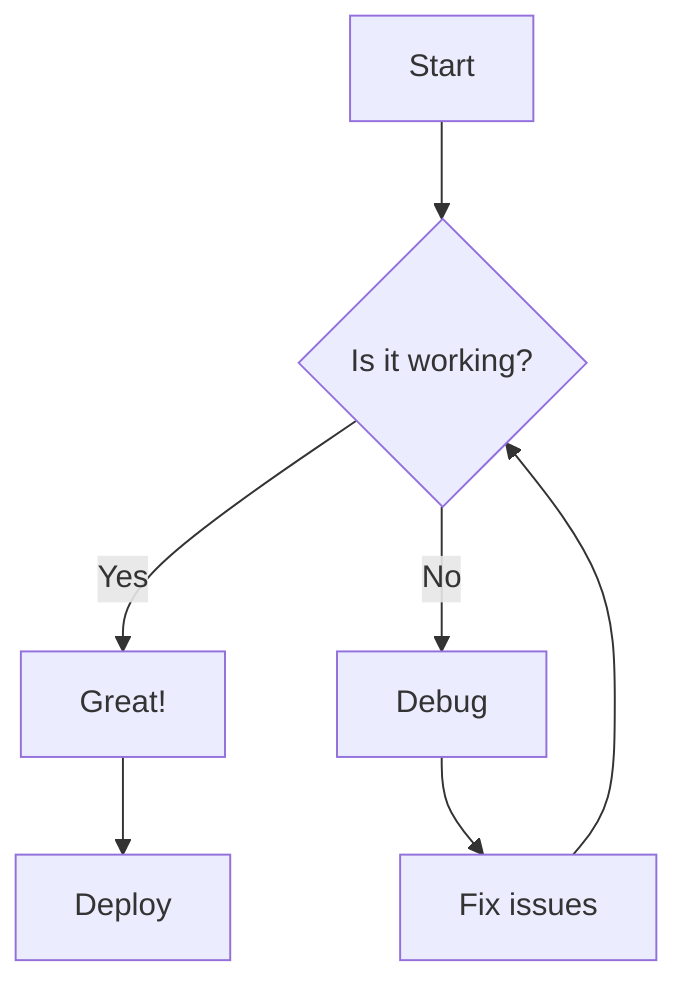
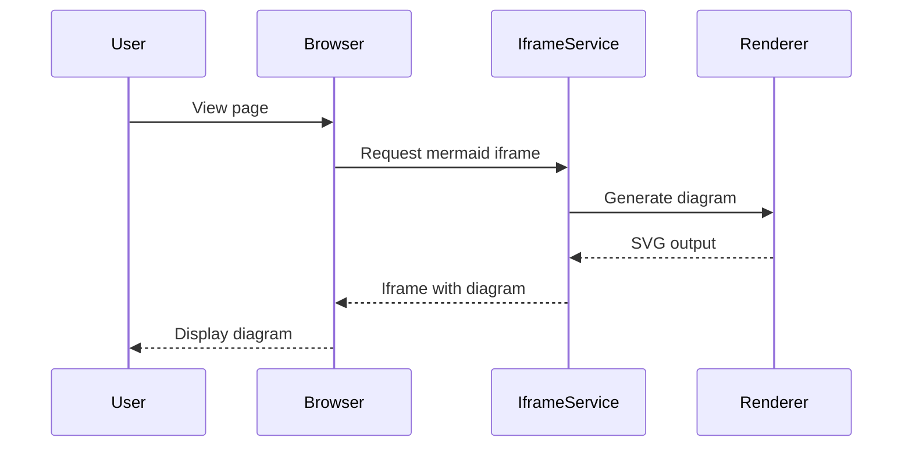
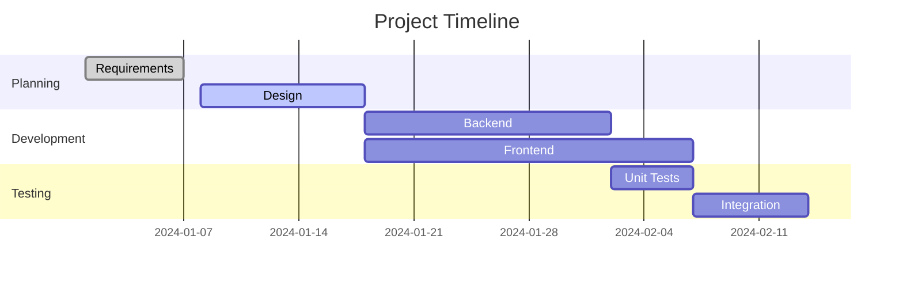
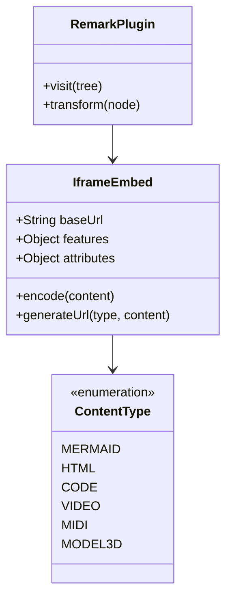
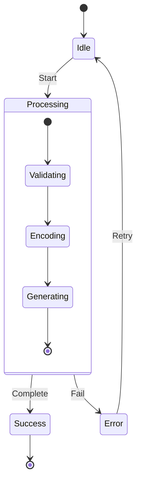
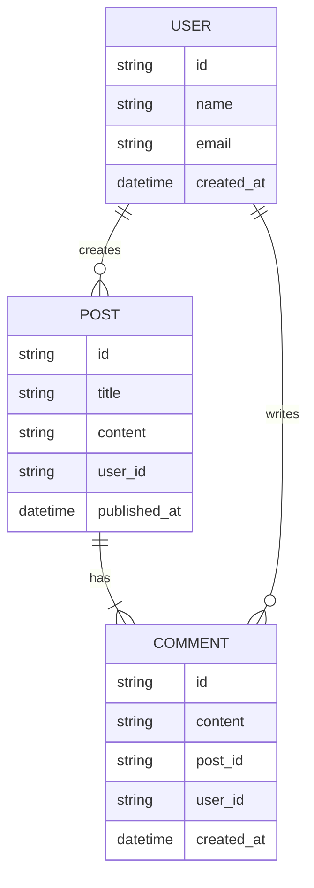
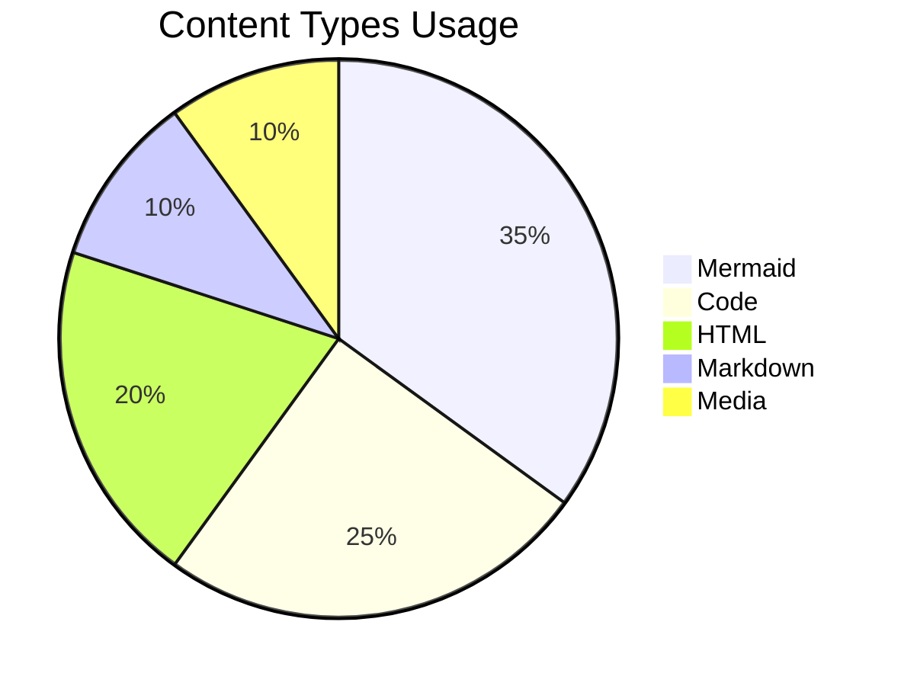

# Iframe Embed Showcase

This page demonstrates the various iframe embed features supported by the repo-iframe-content service and remark-iframe-embed plugin.

## Mermaid Diagrams

Mermaid diagrams are converted to iframes by default for better rendering:

### Flowchart



### Sequence Diagram



### Gantt Chart



### Class Diagram



### State Diagram



### Entity Relationship Diagram



### Pie Chart



## Code Blocks

When `features.code = true`, code blocks are converted to iframes with syntax highlighting:

### JavaScript

```javascript
// Example React component with hooks
import React, { useState, useEffect, useCallback } from "react";
import { debounce } from "lodash";

const IframeDemo = ({ src, title, onLoad }) => {
  const [loading, setLoading] = useState(true);
  const [error, setError] = useState(null);
  const [dimensions, setDimensions] = useState({ width: 0, height: 0 });

  // Debounced resize handler
  const handleResize = useCallback(
    debounce(() => {
      if (iframeRef.current) {
        const { width, height } = iframeRef.current.getBoundingClientRect();
        setDimensions({ width, height });
      }
    }, 300),
    []
  );

  useEffect(() => {
    window.addEventListener("resize", handleResize);
    return () => window.removeEventListener("resize", handleResize);
  }, [handleResize]);

  const handleLoad = () => {
    setLoading(false);
    onLoad?.();
  };

  const handleError = (e) => {
    setError("Failed to load iframe content");
    setLoading(false);
  };

  return (
    <div className="iframe-container">
      {loading && <div className="loader">Loading...</div>}
      {error && <div className="error">{error}</div>}
      <iframe
        ref={iframeRef}
        src={src}
        title={title}
        onLoad={handleLoad}
        onError={handleError}
        style={{
          display: loading ? "none" : "block",
          width: "100%",
          height: "100%",
          border: "none",
        }}
      />
      <div className="dimensions">
        {dimensions.width} x {dimensions.height}
      </div>
    </div>
  );
};

export default IframeDemo;
```

### Python

```python
# Advanced Python example with async/await and type hints
import asyncio
from typing import List, Dict, Optional, AsyncIterator
from dataclasses import dataclass
from datetime import datetime
import aiohttp

@dataclass
class Repository:
    """GitHub repository data class"""
    name: str
    owner: str
    stars: int
    language: Optional[str]
    created_at: datetime

    @property
    def full_name(self) -> str:
        return f"{self.owner}/{self.name}"

class GitHubClient:
    """Async GitHub API client"""

    def __init__(self, token: Optional[str] = None):
        self.token = token
        self.base_url = "https://api.github.com"
        self.session: Optional[aiohttp.ClientSession] = None

    async def __aenter__(self):
        headers = {"Accept": "application/vnd.github.v3+json"}
        if self.token:
            headers["Authorization"] = f"token {self.token}"
        self.session = aiohttp.ClientSession(headers=headers)
        return self

    async def __aexit__(self, exc_type, exc_val, exc_tb):
        if self.session:
            await self.session.close()

    async def get_repo(self, owner: str, name: str) -> Repository:
        """Fetch a single repository"""
        async with self.session.get(f"{self.base_url}/repos/{owner}/{name}") as resp:
            data = await resp.json()
            return Repository(
                name=data["name"],
                owner=data["owner"]["login"],
                stars=data["stargazers_count"],
                language=data.get("language"),
                created_at=datetime.fromisoformat(data["created_at"].replace("Z", "+00:00"))
            )

    async def search_repos(self, query: str, limit: int = 10) -> AsyncIterator[Repository]:
        """Search repositories with pagination"""
        page = 1
        count = 0

        while count < limit:
            params = {"q": query, "page": page, "per_page": min(100, limit - count)}
            async with self.session.get(f"{self.base_url}/search/repositories", params=params) as resp:
                data = await resp.json()

                if not data.get("items"):
                    break

                for item in data["items"]:
                    if count >= limit:
                        break

                    yield Repository(
                        name=item["name"],
                        owner=item["owner"]["login"],
                        stars=item["stargazers_count"],
                        language=item.get("language"),
                        created_at=datetime.fromisoformat(item["created_at"].replace("Z", "+00:00"))
                    )
                    count += 1

                page += 1

# Example usage
async def main():
    async with GitHubClient() as client:
        # Get a specific repo
        repo = await client.get_repo("facebook", "react")
        print(f"{repo.full_name} has {repo.stars:,} stars")

        # Search for repos
        print("\nTop Python ML repositories:")
        async for repo in client.search_repos("machine learning language:python", limit=5):
            print(f"- {repo.full_name}: {repo.stars:,} stars")

if __name__ == "__main__":
    asyncio.run(main())
```

### TypeScript

```typescript
// Advanced TypeScript with generics, decorators, and type utilities
import { EventEmitter } from "events";

// Custom type utilities
type DeepPartial<T> = T extends object
  ? {
      [P in keyof T]?: DeepPartial<T[P]>;
    }
  : T;

type DeepReadonly<T> = T extends object
  ? {
      readonly [P in keyof T]: DeepReadonly<T[P]>;
    }
  : T;

// Decorator factory
function log(target: any, propertyKey: string, descriptor: PropertyDescriptor) {
  const originalMethod = descriptor.value;

  descriptor.value = function (...args: any[]) {
    console.log(`Calling ${propertyKey} with args:`, args);
    const result = originalMethod.apply(this, args);
    console.log(`Result:`, result);
    return result;
  };

  return descriptor;
}

// Generic constraint example
interface HasId {
  id: string | number;
}

class Repository<T extends HasId> {
  private items = new Map<string | number, T>();

  add(item: T): void {
    this.items.set(item.id, item);
  }

  @log
  find(id: string | number): T | undefined {
    return this.items.get(id);
  }

  findAll(predicate?: (item: T) => boolean): T[] {
    const items = Array.from(this.items.values());
    return predicate ? items.filter(predicate) : items;
  }

  update(id: string | number, updates: DeepPartial<T>): T | undefined {
    const item = this.items.get(id);
    if (item) {
      const updated = { ...item, ...updates };
      this.items.set(id, updated);
      return updated;
    }
    return undefined;
  }
}

// Advanced generic event emitter
type EventMap = Record<string, any>;

class TypedEventEmitter<T extends EventMap> extends EventEmitter {
  emit<K extends keyof T>(event: K, data: T[K]): boolean {
    return super.emit(event as string, data);
  }

  on<K extends keyof T>(event: K, listener: (data: T[K]) => void): this {
    return super.on(event as string, listener);
  }

  off<K extends keyof T>(event: K, listener: (data: T[K]) => void): this {
    return super.off(event as string, listener);
  }
}

// Usage example
interface User extends HasId {
  id: number;
  name: string;
  email: string;
  roles: string[];
}

interface AppEvents {
  "user:login": { user: User; timestamp: Date };
  "user:logout": { userId: number; reason: string };
  "data:update": { table: string; ids: number[] };
}

const userRepo = new Repository<User>();
const events = new TypedEventEmitter<AppEvents>();

// Type-safe event handling
events.on("user:login", ({ user, timestamp }) => {
  console.log(`${user.name} logged in at ${timestamp}`);
  userRepo.add(user);
});

// Example with conditional types
type ExtractArrayType<T> = T extends (infer U)[] ? U : never;
type ExtractPromiseType<T> = T extends Promise<infer U> ? U : never;

type StringArray = ExtractArrayType<string[]>; // string
type PromiseString = ExtractPromiseType<Promise<string>>; // string
```

### SQL

```sql
-- Complex SQL example with CTEs, window functions, and JSON operations
WITH user_activity AS (
    SELECT
        u.id,
        u.username,
        u.email,
        u.created_at,
        COUNT(DISTINCT p.id) as post_count,
        COUNT(DISTINCT c.id) as comment_count,
        MAX(p.created_at) as last_post_date,
        MAX(c.created_at) as last_comment_date
    FROM users u
    LEFT JOIN posts p ON u.id = p.user_id
    LEFT JOIN comments c ON u.id = c.user_id
    WHERE u.is_active = true
    GROUP BY u.id, u.username, u.email, u.created_at
),
engagement_metrics AS (
    SELECT
        ua.*,
        COALESCE(ua.post_count * 10 + ua.comment_count * 5, 0) as engagement_score,
        RANK() OVER (ORDER BY ua.post_count DESC) as post_rank,
        DENSE_RANK() OVER (ORDER BY ua.comment_count DESC) as comment_rank,
        NTILE(4) OVER (ORDER BY COALESCE(ua.post_count * 10 + ua.comment_count * 5, 0)) as engagement_quartile
    FROM user_activity ua
),
user_tags AS (
    SELECT
        p.user_id,
        ARRAY_AGG(DISTINCT t.name ORDER BY t.name) as tags,
        JSON_BUILD_OBJECT(
            'most_used', MODE() WITHIN GROUP (ORDER BY t.name),
            'unique_count', COUNT(DISTINCT t.id),
            'total_uses', COUNT(*)
        ) as tag_stats
    FROM posts p
    JOIN post_tags pt ON p.id = pt.post_id
    JOIN tags t ON pt.tag_id = t.id
    GROUP BY p.user_id
)
SELECT
    em.username,
    em.email,
    em.created_at::date as join_date,
    DATE_PART('day', NOW() - em.created_at) as days_since_joined,
    em.post_count,
    em.comment_count,
    em.engagement_score,
    CASE
        WHEN em.engagement_quartile = 1 THEN 'Low'
        WHEN em.engagement_quartile = 2 THEN 'Medium'
        WHEN em.engagement_quartile = 3 THEN 'High'
        WHEN em.engagement_quartile = 4 THEN 'Very High'
    END as engagement_level,
    em.post_rank,
    em.comment_rank,
    COALESCE(ut.tags, ARRAY[]::text[]) as user_tags,
    ut.tag_stats,
    CASE
        WHEN em.last_post_date > NOW() - INTERVAL '7 days' THEN 'Active'
        WHEN em.last_post_date > NOW() - INTERVAL '30 days' THEN 'Moderate'
        ELSE 'Inactive'
    END as activity_status
FROM engagement_metrics em
LEFT JOIN user_tags ut ON em.id = ut.user_id
WHERE em.engagement_score > 0
ORDER BY em.engagement_score DESC
LIMIT 100;
```

## HTML Blocks

When `features.html = true`, HTML blocks are embedded as iframes:

```html
<!doctype html>
<html lang="en">
  <head>
    <meta charset="UTF-8" />
    <meta name="viewport" content="width=device-width, initial-scale=1.0" />
    <title>Interactive Demo</title>
    <style>
      * {
        margin: 0;
        padding: 0;
        box-sizing: border-box;
      }

      body {
        font-family: -apple-system, BlinkMacSystemFont, "Segoe UI", Roboto,
          sans-serif;
        background: linear-gradient(135deg, #667eea 0%, #764ba2 100%);
        min-height: 100vh;
        display: flex;
        justify-content: center;
        align-items: center;
        padding: 20px;
      }

      .container {
        background: white;
        border-radius: 20px;
        box-shadow: 0 20px 40px rgba(0, 0, 0, 0.1);
        padding: 40px;
        max-width: 600px;
        width: 100%;
      }

      h1 {
        color: #333;
        margin-bottom: 20px;
        text-align: center;
      }

      .counter-display {
        font-size: 72px;
        font-weight: bold;
        text-align: center;
        margin: 40px 0;
        color: #667eea;
        transition: transform 0.2s;
      }

      .counter-display.pulse {
        animation: pulse 0.3s ease-in-out;
      }

      @keyframes pulse {
        0% {
          transform: scale(1);
        }
        50% {
          transform: scale(1.1);
        }
        100% {
          transform: scale(1);
        }
      }

      .button-group {
        display: flex;
        gap: 10px;
        justify-content: center;
        flex-wrap: wrap;
      }

      button {
        background: #667eea;
        color: white;
        border: none;
        padding: 12px 24px;
        border-radius: 8px;
        font-size: 16px;
        font-weight: 600;
        cursor: pointer;
        transition: all 0.3s;
        position: relative;
        overflow: hidden;
      }

      button:hover {
        background: #764ba2;
        transform: translateY(-2px);
        box-shadow: 0 5px 15px rgba(0, 0, 0, 0.2);
      }

      button:active {
        transform: translateY(0);
      }

      .ripple {
        position: absolute;
        border-radius: 50%;
        background: rgba(255, 255, 255, 0.5);
        transform: scale(0);
        animation: ripple 0.6s ease-out;
      }

      @keyframes ripple {
        to {
          transform: scale(4);
          opacity: 0;
        }
      }

      .history {
        margin-top: 40px;
        padding-top: 20px;
        border-top: 1px solid #eee;
      }

      .history h2 {
        font-size: 18px;
        margin-bottom: 10px;
        color: #666;
      }

      .history-list {
        max-height: 150px;
        overflow-y: auto;
        font-size: 14px;
        color: #888;
      }

      .history-item {
        padding: 5px;
        border-bottom: 1px solid #f0f0f0;
      }
    </style>
  </head>
  <body>
    <div class="container">
      <h1>Advanced Counter Demo</h1>
      <div id="counter" class="counter-display">0</div>
      <div class="button-group">
        <button onclick="changeCount(1)">+1</button>
        <button onclick="changeCount(5)">+5</button>
        <button onclick="changeCount(10)">+10</button>
        <button onclick="changeCount(-1)">-1</button>
        <button onclick="changeCount(-5)">-5</button>
        <button onclick="reset()">Reset</button>
      </div>
      <div class="history">
        <h2>History</h2>
        <div id="history" class="history-list"></div>
      </div>
    </div>

    <script>
      let count = 0;
      let history = [];
      const counterEl = document.getElementById("counter");
      const historyEl = document.getElementById("history");

      function updateDisplay() {
        counterEl.textContent = count;
        counterEl.classList.add("pulse");
        setTimeout(() => counterEl.classList.remove("pulse"), 300);
      }

      function addToHistory(action) {
        const timestamp = new Date().toLocaleTimeString();
        history.unshift(`${timestamp}: ${action} (Total: ${count})`);
        if (history.length > 10) history.pop();

        historyEl.innerHTML = history
          .map((item) => `<div class="history-item">${item}</div>`)
          .join("");
      }

      function changeCount(amount) {
        count += amount;
        updateDisplay();
        addToHistory(`${amount > 0 ? "+" : ""}${amount}`);
      }

      function reset() {
        count = 0;
        updateDisplay();
        addToHistory("Reset");
      }

      // Add ripple effect to buttons
      document.querySelectorAll("button").forEach((button) => {
        button.addEventListener("click", function (e) {
          const rect = this.getBoundingClientRect();
          const ripple = document.createElement("span");
          ripple.className = "ripple";
          ripple.style.width = ripple.style.height = "40px";
          ripple.style.left = e.clientX - rect.left - 20 + "px";
          ripple.style.top = e.clientY - rect.top - 20 + "px";
          this.appendChild(ripple);
          setTimeout(() => ripple.remove(), 600);
        });
      });
    </script>
  </body>
</html>
```

## Markdown Blocks

When `features.markdown = true`, markdown content blocks are rendered as iframes:

```markdown
# Embedded Markdown Demo

This is a **markdown** block that demonstrates various markdown features when rendered in an iframe.

## Text Formatting

- **Bold text** using `**text**`
- _Italic text_ using `*text*`
- **_Bold and italic_** using `***text***`
- ~~Strikethrough~~ using `~~text~~`
- `Inline code` using backticks

## Lists

### Unordered List

- First item
- Second item
  - Nested item 1
  - Nested item 2
- Third item

### Ordered List

1. First step
2. Second step
   1. Sub-step A
   2. Sub-step B
3. Third step

## Tables

| Feature  | Status       | Description                            |
| -------- | ------------ | -------------------------------------- |
| Mermaid  | ✅ Default   | Automatically converted to iframes     |
| Code     | ❌ Optional  | Enable with `features.code = true`     |
| HTML     | ❌ Optional  | Enable with `features.html = true`     |
| Markdown | ❌ Optional  | Enable with `features.markdown = true` |
| Media    | ✅ URL-based | Automatic for supported file types     |

## Blockquotes

> **Note**: This is an important note about iframe embedding.
>
> Multiple paragraphs in blockquotes are supported.

## Code Examples

Inline code: `const x = 42;`

Code block:
```

function example() {
return "This won't be syntax highlighted in markdown view";
}

```

## Links and Images

[Visit GitHub](https://github.com)


## Task Lists

- [x] Implement basic iframe embedding
- [x] Add mermaid support
- [ ] Add full media support
- [ ] Implement security features

## Horizontal Rule

---

## Emoji Support

:smile: :heart: :rocket: (if emoji support is enabled)

## Math (if supported)

Inline math: $e^{i\pi} + 1 = 0$

Block math:
$$
\int_{-\infty}^{\infty} e^{-x^2} dx = \sqrt{\pi}
$$
```

## Media Embeds (Direct URLs)

When `processNakedUrls = true`, media URLs are automatically converted to iframes:

### MIDI Files

Here are some MIDI files that would be automatically embedded:

https://www.midiworld.com/download/4573

https://bitmidi.com/uploads/101589.mid

### 3D Models

These 3D model URLs would be automatically embedded:

https://raw.githubusercontent.com/KhronosGroup/glTF-Sample-Models/master/2.0/Box/glTF-Binary/Box.glb

https://raw.githubusercontent.com/KhronosGroup/glTF-Sample-Models/master/2.0/Duck/glTF/Duck.gltf

### Video Files

Video URLs that would be embedded:

https://sample-videos.com/video123/mp4/720/big_buck_bunny_720p_1mb.mp4

https://www.w3schools.com/html/mov_bbb.mp4

### Code Sharing Platforms

GitHub Gists:
https://gist.github.com/schacon/1

CodePen:
https://codepen.io/chriscoyier/pen/JpgxEa

JSFiddle:
https://jsfiddle.net/boilerplate/jquery

## Advanced Configuration Examples

### Enable All Features

```javascript
remarkIframeEmbed({
  features: {
    mermaid: true, // Default
    html: true, // Enable HTML iframe embedding
    markdown: true, // Enable Markdown iframe embedding
    code: true, // Enable code block iframe embedding
    video: true, // Enable video URL detection
    midi: true, // Enable MIDI URL detection
    model3d: true, // Enable 3D model URL detection
  },
  processNakedUrls: true, // Process URLs in text
  processLinks: false, // Don't process markdown links
});
```

### Custom Heights

```javascript
remarkIframeEmbed({
  heights: {
    default: "400px",
    mermaid: "500px",
    code: "350px",
    html: "600px",
    markdown: "400px",
    video: "360px",
    midi: "200px",
    model3d: "600px",
  },
});
```

### Security Configuration

```javascript
remarkIframeEmbed({
  security: {
    sandbox: "allow-scripts allow-same-origin allow-forms",
    allowedDomains: ["github.com", "githubusercontent.com", "codepen.io"],
    blockDomains: ["suspicious-site.com"],
  },
});
```

### Advanced Features

```javascript
remarkIframeEmbed({
  advancedFeatures: {
    code: {
      enabled: true,
      languages: ["javascript", "typescript", "python"],
      minLines: 10, // Only embed code with 10+ lines
      maxLines: 100, // Don't embed code with 100+ lines
      attributes: {
        height: "400px",
        "data-theme": "dark",
      },
    },
    mermaid: {
      enabled: true,
      condition: (content) => {
        // Only embed complex diagrams
        return content.split("\n").length > 5;
      },
      attributes: {
        height: "600px",
        class: "mermaid-diagram",
      },
    },
  },
});
```

### Custom Content Types

```javascript
remarkIframeEmbed({
  // Add PlantUML support
  urlPatterns: [
    ...defaultUrlPatterns,
    {
      pattern: /https?:\/\/[^\s]+\.puml/i,
      contentType: "plantuml",
      extractUrl: (match) => match[0],
    },
  ],

  customTransformers: {
    plantuml: (content, baseUrl, encoding) => {
      return `${baseUrl}/plantuml/${encodeContent(content, encoding.method, encoding.urlEncode)}`;
    },
  },

  advancedFeatures: {
    plantuml: {
      enabled: true,
      attributes: { height: "400px" },
    },
  },
});
```

## Benefits of Iframe Embedding

1. **Isolation**: Content runs in a sandboxed environment, preventing CSS/JS conflicts
2. **Performance**: Heavy processing (like Mermaid rendering) happens in the iframe service
3. **Consistency**: Rendering is consistent across all platforms and browsers
4. **Security**: Potentially unsafe content is isolated from the main page
5. **Caching**: Iframe content can be cached separately at the CDN level
6. **Lazy Loading**: Iframes can be loaded on-demand with `loading="lazy"`
7. **Modularity**: Each content type has its own dedicated handler

## Testing Checklist

- [x] Mermaid diagrams render as iframes by default
- [ ] Code blocks render as iframes when `features.code = true`
- [ ] HTML blocks render as iframes when `features.html = true`
- [ ] Markdown blocks render as iframes when `features.markdown = true`
- [ ] MIDI URLs are detected and embedded when `processNakedUrls = true`
- [ ] 3D model URLs are detected and embedded
- [ ] Video URLs are detected and embedded
- [ ] Security settings properly filter domains
- [ ] Custom heights are applied correctly
- [ ] Advanced features work as configured

## Troubleshooting

### Common Issues

1. **Iframes not loading**: Check browser console for CSP violations
2. **Content not transformed**: Verify feature is enabled in configuration
3. **URLs not detected**: Ensure `processNakedUrls` is true
4. **Security errors**: Check domain allow/block lists

### Debug Mode

Enable debug logging:

```javascript
remarkIframeEmbed({
  debug: true, // Logs transformation decisions
});
```

## Conclusion

The iframe embed system provides a powerful way to enhance markdown content with rich, interactive elements while maintaining security and performance. The modular architecture allows for easy extension and customization to meet specific needs.
