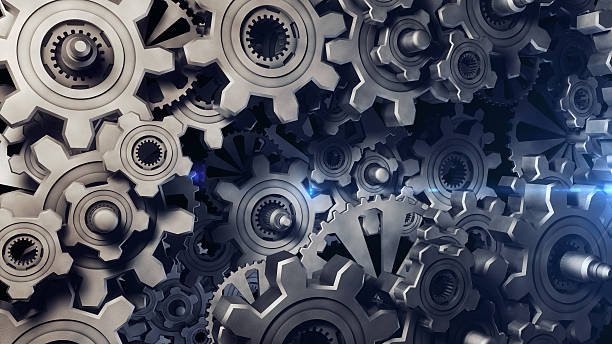

# Emma Reyes

## Contemporary Mixed Media Artist

[[dog]] page with many aliases:

Here are obsidian links:

[[code]]

[[portraits]]

[[portraits|portrait-with custom name]]

[portraits](portraits.md)

And same within a sentence about [[code]] and [[portraits]]. As well as within other anchor test [when i talk about street portarits](portraits.md).

Here's are HTML link to the same pages
<a href="code.md"> code </a>

<a href="projects/portraits.md"> code </a>

## Welcome to My Creative Space

Hello! I'm Emma, a mixed media artist based in Portland, creating works that blur the boundaries between painting, collage, and textile art. My pieces explore themes of memory, identity, and the natural world through vibrant colors and unexpected textures.

I believe art should invite curiosity and create conversation. Each piece I create tells a story—sometimes mine, sometimes yours, and often somewhere in between.

---

## Featured Works

### "Fragments of Autumn"

_Mixed media on canvas, 36" × 48"_

A meditation on change and renewal, incorporating pressed leaves, handmade paper, and layers of translucent acrylics that shift with the light.

### "Urban Whispers"

_Textile assemblage with oil pastel, 24" × 30"_

Inspired by city landscapes at dusk, this piece weaves together found fabric, photographs, and hand-stitched elements to create a tactile urban landscape.

### "Echoes of Home"

_Collage with watercolor and ink, 18" × 24"_

An exploration of belonging, featuring fragments of old letters, maps, and botanical drawings layered with delicate washes of color.

[View Full Gallery →](#)

---

## Upcoming Events

**Solo Exhibition:** "Between Worlds" at Riverside Gallery
_May 15 - June 30, 2025_

**Artist Talk:** Creative Process Workshop at Portland Art Center
_June 12, 2025 | 2:00 PM_

**Art Fair:** Pacific Northwest Arts Festival
_July 8-10, 2025 | Booth #42_

[See All Events →](#)

---

## Recent Recognition

> "Emma Reyes creates layered worlds that invite viewers to look closer, then closer still—revealing intimate stories within stories."
> — _Northwest Arts Magazine_, March 2025

> "Her innovative use of materials transforms everyday objects into meaningful narratives that resonate with authentic emotion."
> — _Contemporary Art Review_, January 2025

---

## Studio Process

My practice is deeply rooted in experimentation and intuition. I begin each piece with a concept or feeling, but allow the materials to guide me through the creation process. My studio is filled with collections of found objects, handmade papers, fabric scraps, and natural elements that often find their way into my work.

I invite you to follow my creative journey on [Instagram](#) where I share works in progress, studio glimpses, and the small moments of inspiration that fuel my practice.

---

## Let's Connect

I'm always open to collaborations, commissions, and conversations about art. Whether you're interested in adding a piece to your collection, discussing a custom work, or just sharing thoughts on creativity, I'd love to hear from you.

[Contact Me →](#)

---
