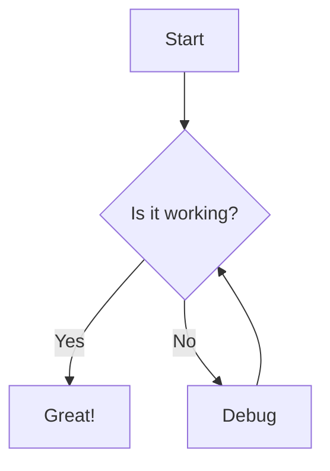
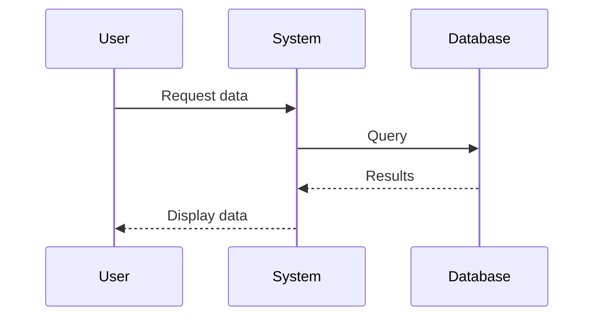
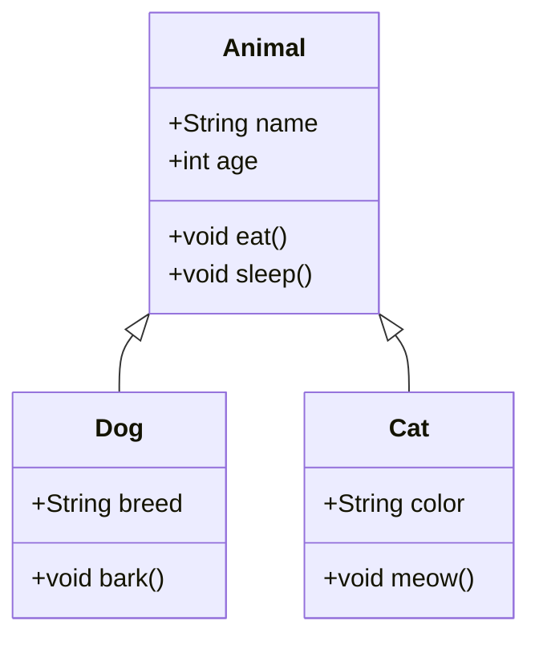

# Mermaid Diagram Test

This page tests the rendering of Mermaid diagrams.

## Simple Flow Chart



## Sequence Diagram



## Regular Code Block

This should remain a regular code block:

```javascript
console.log('This is not a mermaid diagram');
```

## Class Diagram

